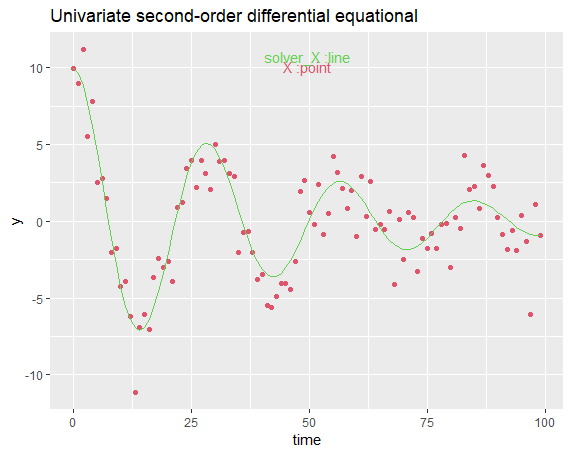
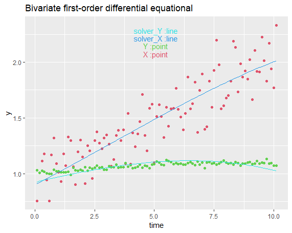
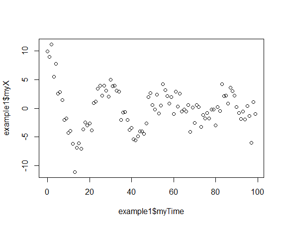
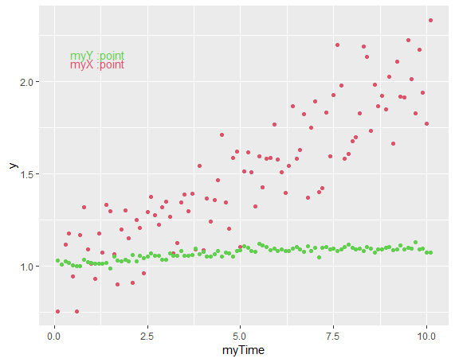

## Getting started
### 1 Overview

##### 1.1 What is deFit?

defit uses numerical optimization to fit ordinary differential equations (ODE) to time series data to examine the dynamic relationships between variables or the characteristics of a dynamical system. It can now be used to estimate the parameters of ODEs up to second order.

##### 1.2 First impression

To get a first impression of how deFit works in simulation, consider the following example of a differential equational model. The figure below contains a graphical representation of the model that we want to fit.
```R
data('example1')
model1 <- '
X =~ myX
time =~ myTime
X(2) ~ X(1) + X
'
result1 <- defit(data = example1, model = model1)
```


### 2 Getting started

##### 2.1 Install R

deFit is implemented as an R package. This means that before installing deFit, you should have installed a recent version(>=4.0.0) of R. You can download the latest version of R from the [R-project website](https://www.r-project.org/).

##### 2.2 Install deFit

Once you have installed R.you can install the deFit package simply by starting up R, and typing
```R
install.packages("deFit", dependencies = TRUE)
```

##### 2.3 Getting Started
Now that you have installed deFit, you can read the tutorial.

### 3 Second impression
```R
library(deFit)
data('example2')
model2 <- '
    # define variable
    X =~ myX
    Y =~ myY

    # define time
    time =~ myTime

    # define differential equation
    X(1) ~ X + Y
    Y(1) ~ Y + X
'
result2 <- defit(data = example2, model = model2)
```



---

## Documentation
### 1 Tutorial

##### 1.1 Overview

Read this, we hope to give you just enough information to get you started (but no more).
Contents:

*   Before you start
*   Installation
*   Model syntax
*   A first example: Univariate first-order differential equational
*   A second example: Bivariate second-order differential equational

##### 2.2 Before you start

First of all, you must have a recent version (4.0.0 or higher) of R installed. You can download the latest version of R from this page: <http://cran.r-project.org/>.
Some important features are NOT available (yet) in

*   Support for univariate second-order differential equational.

```math
    \ddot{x} \sim x + \dot{x} 
```
```math
    \ddot{x} = β_1 x + β_1 \dot{x} + e 
```

*   Support for bivariate first-order differential equational

```math
    \begin{cases}
\dot{x} = x + y,\\
\dot{y} = x + y, 
\end{cases}
```
```math
\begin{cases}
\dot{x} = β_1 x +  β_2 y + e,\\
\dot{y} = β_3 x + β_4 y + e, 
\end{cases}
```

The more information you can read the example. We will add more model of differential equational models. hold on...

### 2 Installation

Once you have installed R.you can install the **deFit** package simply by starting up R, and typing
```R
install.packages("deFit", dependencies = TRUE)
```
You can check if the installation was succesful by typing
```R
library(deFit)
```

You are ready to start.

### 3 Model syntax

At the heart of the deFit package is the 'model syntax'.The model syntax is a description of the model to be estimated. In this section, we briefly explain the elements of the deFit model syntax. More details are given in the examples that follow.
To reduce learning costs, the model syntax is similar to regression and [lavaan](https://lavaan.ugent.be/tutorial/cfa.html) in R.

##### 3.1 operator '=\~' variable definitions

Because our differential equational formulas have variable, we must 'define' them by listing their indicators. We do this by using the special operator "=\~", which can be read as is measured by. For example, to define the two variabels X and Y, we can use something like:
```R
X =~ myX
Y =~ myY
```
`myX` and `myY` are columns' names of your data.

##### 3.2 operator '=\~' must contain 'time' on the left.

Especially, this package is that analysis the intensive longitudinal data. So, you must define a 'time' variable. And the variable 'time' can not change (the left of the operator '=\~', which 'time' can not be changed).
```
time =~ time
```
You can use the 'time' column's name of your data to repalce the 'time' on the right of the operator '=\~'.
```
time =~ myTime
```
##### 3.3 operator '\~' formula definitions

In the R environment, a regression formula has the following form:
```
y ~ x1 + x2 + x3 + x4
```
In this formula, the tilde (“\~”) is the regression operator. On the left-hand side of the operator, we have the dependent variable (y), and on the right-hand side, we have the independent variables, separated by the “+” operator. In deFit, a typical model is simply a set (or system) of differential equational formulas. For example:

$$
\ddot{X} \sim X + \dot{X} \\
$$
```
    X(2) ~ X + X(1)
```
$\dot{X}$ is `X(1)`: The meaning is the x's first-order derivative.

$\ddot{X}$ is `X(2)`: The meaning is the x's second-order derivative.

##### 3.4 summarize the model dyntax

Using these formula types, a large variety of differential models can be descirbed. The current set of formula types is summarized in the table below.

| formula type            | operator | mnemonic       |
| ----------------------- | -------- | -------------- |
| variable definition     | =\~      | is measured by |
| differential equational | \~       | is DE on       |
| derivative              | ()       | Nth-order      |

`time =~ myTime` must be contianed.

A complete deFit model syntax si simply a combination of these formula types, enclosed between single quotes. For example:
``` R
model2 <- '
    # define variable
    X =~ myX
    Y =~ myY

    # define time
    time =~ myTime

    # define differential equation
    X(1) ~ X + Y
    Y(1) ~ Y + X
  '
```
When fitting the model, you may tell the 'defit' function data and model as follows:
```R
result <- defit(data = example2, model = model2)
```
### 4 A first example: Univariate first-order differential equational

The damped oscillator model helps describe the regulatory process. We can use an example to explore that.
##### 4.1 The example1 data 
The example1 file reports data from a simulation of a second-order differential equational.Signal to noise ratio (SNR) is 2:1 and the sample size is n=100. Then we try to use differential equational to describe the data.
```R
> library(deFit)
> data("example1")
> str(example1)
'data.frame':	100 obs. of  3 variables:
 $ seq   : int  1 2 3 4 5 6 7 8 9 10 ...
 $ myTime: int  0 1 2 3 4 5 6 7 8 9 ...
 $ myX   : num  9.97 9 11.2 5.54 7.81 ...
```
Here, time is the time since we study start. 'seq' is a sequence. 'myX' is the variable that we care about. Let us plot the data.

```R
> plot(x=example1$myTime,y=example1$myX)
```

##### 4.2 Fitting differential equational models to the data
There is data's columns contain 'myTime' and variable 'myX'. So, we can build a model by univariate second-order differential equational.
4-2-1

$$
\ddot{X} \sim X + \dot{X} 
$$

And the equation 4-2-1 is simply an expression. So, we add the coefficients of differential quational.
4-2-2
```math
\ddot{X} = β_1 X + β_1 \dot{X} + e
```
It's about a time of differential equational. So, we should tell the equational initial values(The values of t0). To reduce the learning cost, the initial values do not need to tell the program. The program will guess initial values from the first value of data.
So, the model can define below:
```R
model1 <- '
  # define variable
  X =~ myX

  # define time
  time =~ myTime

  # define differential equation
  X(2) ~ X(1) + X
  '
```
where
`X` is the X's 0-order derivative(X stands for the current location).
$\dot{X}$ is the X's first-order derivative.
$\ddot{X}$ is the X's second-order derivative.
$β_1$ is the coefficient of X's first-order derivative.
$β_2$ is the coefficient of X's second-order derivative.
The different coefficients ( $β_1$ , $β_2$ ) and initial values have different trends with time.
> More about initial values problem you can read [The Numerical Solution of Differential-Algebraic Systems by Runge-Kutta Methods](https://link.springer.com/book/10.1007/BFb0093947)
> Or, Damped oscillator model[(Hu & Huang, 2018)](https://doi.org/10.1080/00273171.2018.1503941)

Then, use the defit function to fit the model.
```R
result1 <- defit(data = example1, model = model1)
```
The result

```R
[1] "-------The Model-------\n"
    field operator  variable
2       X       =~       myX
5    time       =~    myTime
8   X(2)         ~  X(1) + X
[1] "-------Your Data(head 3)-------\n"
  seq myTime       myX
1   1      0  9.967876
2   2      1  8.998657
3   3      2 11.196752
[1] "Univariate second-order differential equational"
[1] "------Begin to calcuate the parameters -------"
[1] "Program will fit the data with univariate second-Order differential equational."
[1] "The differential equational presents as:"
[1] "x(2) = β1 * x + β2 * x(1)"
[1] "Program is using the  L-BFGS-B method"
[1] "The program's initial guess values are"
[1] "β1: 0 ,β2: 0 ,t01: 9.967875535 ,t02: 0 ,t03: 0 ,t04: 0"
   variable        values           SE
1 X(0)→X(2) -4.745853e-02 1.590180e-03
2 X(1)→X(2) -4.973902e-02 3.426331e-04
3    init01  9.940378e+00 2.092934e-01
4    init02 -9.385650e-02 4.881139e-02
5    init03 -3.937747e-10 2.982646e+02
6    init04  0.000000e+00 6.813985e-02
[1] "successful:successful completion:(which is always the case for SANN and Brent)"
```
The plot would print by itself.


You can use the summary function to know all the result information.

```R
> summary(result1)
            Length Class      Mode     
userdata     3     data.frame list     
parameter    6     -none-     list     
predict      2     data.frame list     
r_squared    1     -none-     character
RMSE         1     -none-     numeric  
SE          36     -none-     numeric  
equation     2     -none-     character
table        3     data.frame list     
convergence  1     -none-     character
```
>**object**: directly type the defit object will print all results. The function summary is used to print the summary of all results, and the exact values of each result can be extracted by the "$" operator.

>**userdata**：the data that contains a sequence 'seq' starting from 1, the original time variable 'time', and all other variables user defined.

>**parameter**: the best set of parameters found, including parameter values, gradient, convergence, message and hessian matrix.

>**predict**: a dataframe of model predicted variable states at each time point.

>**r_squared**: r_squared is the square of the correlation between the observed values and the predicted values, representing the proportion of variance explained by the model.

>**RMSE**: RMSE (Root Mean Squared Error) is the standard deviation of the residuals.

>**SE**: a symmetric matrix giving standard error of the model parameters.

>**equation**: a string prints the estimated differential equations and initial states.

>**table**: a summary table of parameter estimates and their corresponding SEs.

>**convergence**: a message returns the result of the optimization convergence check.

For the detials of the result, you can use `$` to print it.

```R
> result1$table
   variable        values           SE
1 X(0)→X(2) -4.745853e-02 1.590180e-03
2 X(1)→X(2) -4.973902e-02 3.426331e-04
3    init01  9.940378e+00 2.092934e-01
4    init02 -9.385650e-02 4.881139e-02
5    init03 -3.937747e-10 2.982646e+02
6    init04  0.000000e+00 6.813985e-02
```
##### 4.3 Report
See more [(Hu & Huang, 2018)](https://doi.org/10.1080/00273171.2018.1503941), [(Zhang et al., 2022)](https://doi.org/10.1111/cdev.13808),
 [(Butner et al., 2021)](https://doi.org/10.1111/sltb.12675)
##### 4.4 Damped oscillator model [(Hu & Huang, 2018)](https://doi.org/10.1080/00273171.2018.1503941)
(4-1)
```math
\ddot{y} + 2 ζ ω \dot{y} + ω^2 y = 0    
```
The damped harmonic oscillator has been frequently used in previous research to model the process of self-regulation (e.g., Boker & Graham, 1998). Equation (4-1) expresses a damped harmonic oscillator, where $\ddot{y}$ stands for the second derivative, $\dot{y}$ stands for the first derivative, and $y$ stands for the current location. The parameter $ω$ is the oscillation frequency, and $ω$ is greater than zero in an oscillating system. The parameter $ζ$ is the damping ratio, and $ζ$ is greater than zero in a damping system. The damped oscillator model with $ω$ > 0 and $ζ$ > 0 describes a system that oscillates with the amplitude gradually decreasing to zero.
##### 4.5 The complete code to specify and fit this model is printed again below:

```R
library(deFit)
data('example1')
model1 <- '
    X =~ myX
    time =~ myTime
    X(2) ~ X(1) + X
    '
result1 <- defit(data = example1, model = model1)
```

### 5 A second example: Bivariate second-order differential equational
The Bivariate second-order differential equational model helps describe the relationship between two variables.

The two variables have a relationship and how to describe it with time. And maybe it changes with promoting by each other. They will increase together. Maybe the two variables all are a negative relationship and they will decrease together. On the other hand, if one variable is a negative impact and the other is a positive impact, the relationship maybe become an oscillating relationship.
##### 5.1 The example2 data
There are two variables in the example2 data and a time serises.

```R
> library(deFit)
> data("example2")
> str(example2)
'data.frame':	101 obs. of  4 variables:
 $ T     : int  1 2 3 4 5 6 7 8 9 10 ...
 $ myTime: num  0.1 0.2 0.3 0.4 0.5 0.6 0.7 0.8 0.9 1 ...
 $ myX   : num  0.754 1.007 1.116 1.179 0.945 ...
 $ myY   : num  1.03 1.01 1.03 1.02 1 ...
```
And plot the data.

```R
library(ggplot2)
plot2 = ggplot(example2,aes(x=myTime))
plot2 = plot2 + geom_point(y=example2$myX,color=2)
plot2 = plot2 + geom_point(y=example2$myY,color=3)
plot2 = plot2 + coord_cartesian(ylim = c(min(c(example2$myX,example2$myY)),max(c(example2$myX,example2$myY))))
plot2 = plot2 + annotate("text",x = max(example2$myX)/2, y = max(c(example2$myX,example2$myY))*0.9, color=2, label = paste('myX',':point'))
plot2 = plot2 + annotate("text",x = max(example2$myX)/2, y = max(c(example2$myX,example2$myY))*0.92, color=3, label = paste('myY',':point'))
plot2
```

##### 5.2 Fitting differential equational models to the data
There is data is contained by 'myTime' and variables 'myX' and 'myY'. So, we can build a model by bivariate first-order differential equational.
5-2-1

```math
    \begin{cases}
\dot{x} \sim x + y,\\
\dot{y} \sim x + y, 
\end{cases}
```
And the equation 5-2-1 is simply an expression. So, we add the coefficients of differential quational.
```math
\begin{cases}
\dot{x} = β_1 x +  β_2 y + e,\\
\dot{y} = β_3 x + β_4 y + e, 
\end{cases}
```
So, the model can define below:
```R
model2 <- '
    # define variable
    X =~ myX
    Y =~ myY

    # define time
    time =~ myTime

    # define differential equation
    X(1) ~ X + Y
    Y(1) ~ Y + X
  '
```
Then, use the defit function to fit the model.

```R
result2 <- defit(data = example2, model = model2)
```
The result

```R
[1] "-------The Model-------\n"
       field operator variable
2          X       =~      myX
3          Y       =~      myY
6       time       =~   myTime
9      X(1)         ~    X + Y
10     Y(1)         ~    Y + X
[1] "-------Your Data(head 3)-------\n"
  T myTime      myX      myY
1 1    0.1 0.753794 1.028922
2 2    0.2 1.007378 1.010037
3 3    0.3 1.115716 1.026445
[1] "Bivariate first-order differential equational"
[1] "------Begin to calcuate the parameters -------"
[1] "Program will fit the data with bivariate first-Order differential equational."
[1] "The differential equational presents as:"
[1] "dx/dt = β1 * x + β2 * y"
[1] "dy/dt = β3 * x + β4 * y"
[1] "Program is using the  Nelder-Mead method"
[1] "The program's initial guess values are"
[1] "β1: 0 ,β2: 0 ,β3: 0 ,β4: 0 ,x0: 0.753794 ,y0: 1.028922"
   variable      values          SE
1 X(0)→X(1) -0.04444872 0.010483338
2 Y(0)→X(1)  0.16572484 0.013342100
3 X(0)→Y(1) -0.10984111 0.004990422
4 Y(0)→Y(1)  0.16282472 0.006199609
5    init01  0.91094431 0.063023462
6    init02  0.92694884 0.029064587
[1] "successful:indicates that the iteration limit maxit had been reached."
```
The plot would print by itself.<br/>


<br/>
You can use the summary function to know all the result information.
```R
> summary(result2)
            Length Class      Mode     
userdata     4     data.frame list     
parameter    6     -none-     list     
predict      3     data.frame list     
r_squared    2     -none-     character
RMSE         2     -none-     numeric  
SE          36     -none-     numeric  
equation     4     -none-     character
table        3     data.frame list     
convergence  1     -none-     character
```
For the detials of the result, you can use  to print it.

```R
> result2$table
   variable      values          SE
1 X(0)→X(1) -0.04444872 0.010483338
2 Y(0)→X(1)  0.16572484 0.013342100
3 X(0)→Y(1) -0.10984111 0.004990422
4 Y(0)→Y(1)  0.16282472 0.006199609
5    init01  0.91094431 0.063023462
6    init02  0.92694884 0.029064587
```

##### 5.3 The complete code to specify and fit this model is printed again below:

```R
library(deFit)
data('example2')
model2 <- '
    # define variable
    X =~ myX
    Y =~ myY

    # define time
    time =~ myTime

    # define differential equation
    X(1) ~ X + Y
    Y(1) ~ Y + X
  '
result2 <- defit(data = example2, model = model2)
```


